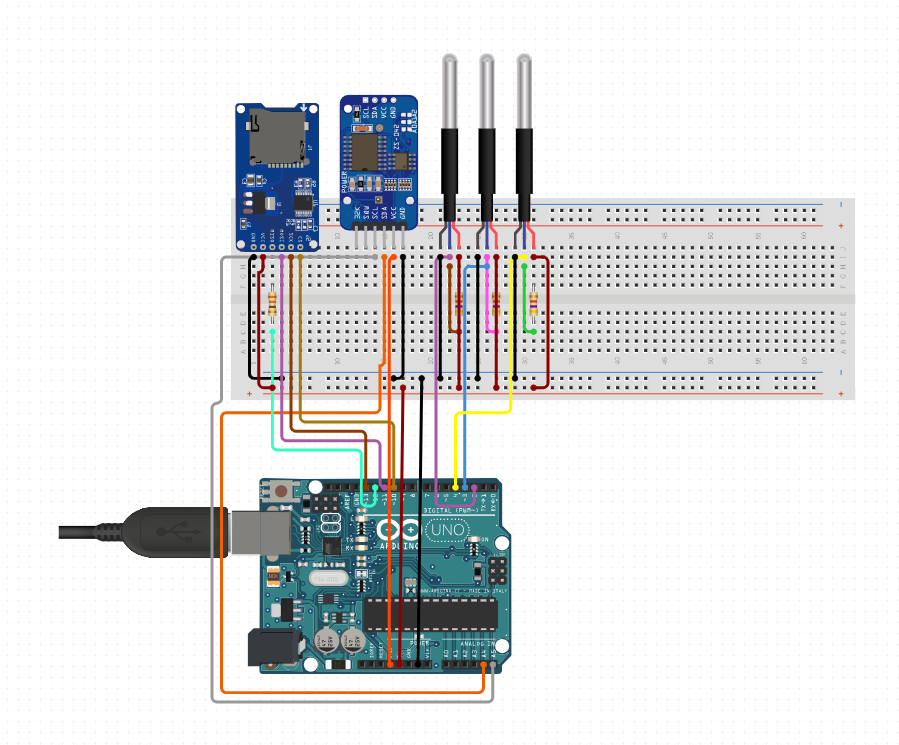

# 📟 Arduino Data Logger de Temperatura

Este proyecto es un **datalogger de temperatura con Arduino** que utiliza **tres sensores de temperatura** y una **tarjeta microSD** para registrar los datos en intervalos definidos.


---

---

## ⚙️ Características

* Compatible con **Arduino Mega/Uno** (ajustable según pines).
* Soporta **3 sensores de temperatura DS18B20**.
* Registro de datos en formato **CSV** dentro de una tarjeta **microSD**.
* Intervalo de muestreo configurable.
* Fácil de escalar para más sensores.

---

## 🛠️ Hardware necesario

* Arduino (Mega o Uno recomendado).
* 3 sensores **DS18B20** con resistencias de pull-up de 4.7kΩ.
* Módulo lector de tarjetas microSD (SPI).
* Tarjeta microSD formateada en FAT32.
* Protoboard y cables Dupont.

---

## 📂 Archivos del repositorio

* **`datalogger_.ino`** → Código principal para leer los sensores y guardar datos en la microSD.
* **`grabar.ino`** → Versión alternativa/simplificada de grabación de datos.

---

## 🔌 Conexiones básicas

### Sensores DS18B20

* VCC → 5V
* GND → GND
* DATA → Pin digital definido en el sketch (ejemplo: 9)
* Resistencia de **4.7kΩ** entre DATA y VCC.

### Módulo microSD

* VCC → 5V
* GND → GND
* MOSI → Pin 11 (Arduino Uno) / 51 (Arduino Mega)
* MISO → Pin 12 (Arduino Uno) / 50 (Arduino Mega)
* SCK  → Pin 13 (Arduino Uno) / 52 (Arduino Mega)
* CS   → Pin 10 (o el que definas en el código)

---

## 📝 Formato de salida

Los datos se almacenan en la tarjeta SD en un archivo `.CSV`, con la siguiente estructura:

```
Fecha,Hora,Temp_Sensor1,Temp_Sensor2,Temp_Sensor3
2025-08-17,12:30:01,23.5,24.1,22.9
2025-08-17,12:31:01,23.6,24.2,23.0
```

Esto permite analizar los datos fácilmente en **Excel, LibreOffice o R/Python**.

---

## ▶️ Uso

1. Cargar el sketch en el Arduino desde el IDE de Arduino.
2. Insertar la microSD formateada en el módulo.
3. Conectar los sensores DS18B20 correctamente.
4. Alimentar el Arduino.
5. Los datos comenzarán a registrarse automáticamente.

---

## 🚀 Futuras mejoras

* Incorporar pantalla LCD/OLED para visualizar datos en tiempo real.
* Conección remota mediante ESP32

---

## 📜 Licencia

Este proyecto se distribuye bajo la licencia **MIT**. Libre para uso, modificación y distribución con fines educativos y personales.

---

👨‍💻 Autor: francorvalan